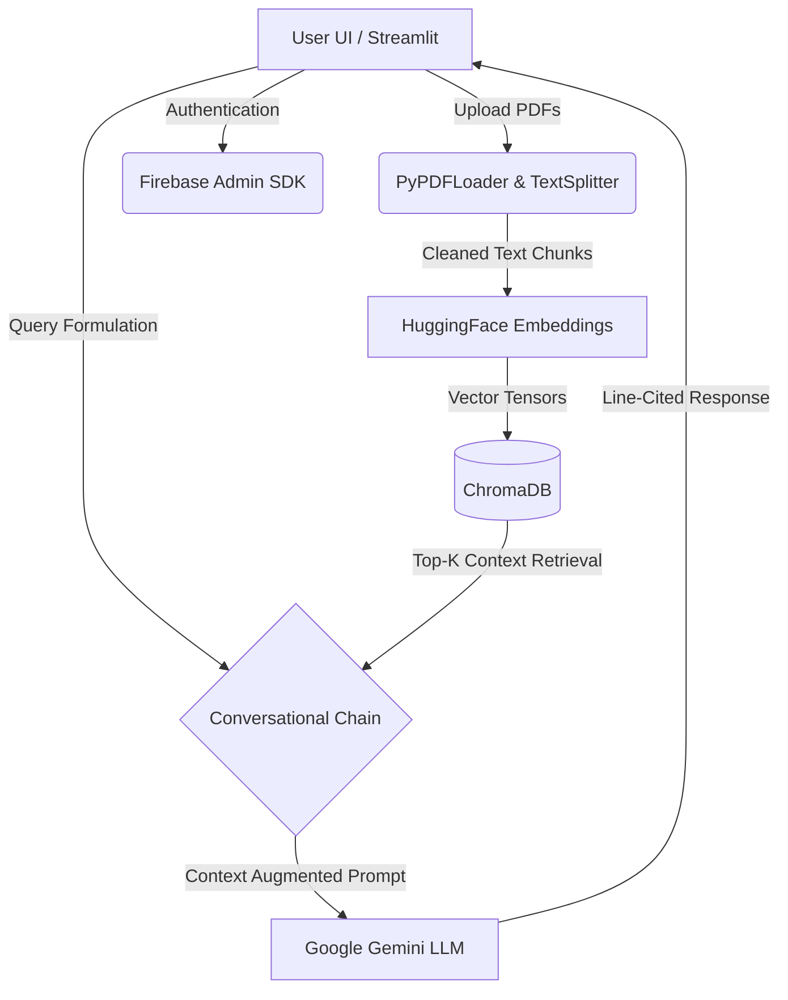

<div align="center">
  
  
  
  
  
  <h1>📄 DocuMind RAG System</h1>
  <p>An advanced, fully-authenticated Retrieval-Augmented Generation (RAG) platform specializing in intelligent PDF embedding, segmentation, and semantic search with line-level citations.</p>
</div>

---

## 📑 Table of Contents
- [Overview](#-overview)
- [System Architecture](#-system-architecture)
- [Features](#-features)
- [Getting Started (Local)](#-getting-started-local)
- [Cloud Deployment](#-cloud-deployment)

---

## 🔍 Overview
DocuMind converts static, multi-page PDF documents into an interactive knowledge base. Utilizing HuggingFace sentence transformers for embeddings and ChromaDB for high-speed localized vector similarity search, DocuMind allows users to dynamically converse with their document datasets.

---

## 📐 System Architecture



---

## 🚀 Features
- **Multi-tenant Authentication**: Secure session management using Firebase Authentication.
- **Dynamic Session State**: Locally cache previous conversational threads to seamlessly switch between chat contexts without resetting the virtual environment.
- **Batch Processing Ingestion**: Process, chunk, and embed thousands of pages across multiple PDF files simultaneously.
- **Granular Semantic Citations**: Automatically appends relevant document origins (filename, exact page, and line approximations) directly to the LLM outputs.
- **Cloud Native**: Abstracted environment variable loading compatible with Streamlit Community Cloud's Secret Manager.

---

## 💻 Getting Started (Local)

### 1. Prerequisites
- Python 3.10+
- A Google Gemini API Key
- A Firebase Project with Authentication (Email/Password) enabled.

### 2. Installation
Clone the repository and install the backend dependencies:
```bash
git clone https://github.com/whatsroopalupto/documind-rag.git
cd documind-rag
pip install -r requirements.txt
```

### 3. Environment Configuration
Create a `.env` file in the root directory and explicitly map the following properties:
```env
GOOGLE_API_KEY="<YOUR_GEMINI_API_KEY>"
FIREBASE_API_KEY="<YOUR_FIREBASE_WEB_API_KEY>"
FIREBASE_KEY_FILE="<NAME_OF_YOUR_LOCALLY_DOWNLOADED_JSON_KEY>"
```
*Be sure to place your downloaded Firebase JSON Admin SDK file directly inside the `/frontend/` folder.*

### 4. Running the Application
Boot the Streamlit server:
```bash
python -m streamlit run frontend/app.py
```

---

## ☁️ Cloud Deployment

DocuMind is structurally configured to deploy seamlessly via **Streamlit Community Cloud**, eliminating the need for Docker containers or custom compute configurations. 

1. Push your latest code to your chosen GitHub branch.
2. Sign into [Streamlit Community Cloud](https://share.streamlit.io/) and select **New App**.
3. Point the deployment entry to `frontend/app.py`.
4. Prior to initiating deployment, click **Advanced Settings** and inject your secure credentials into the **Secrets manager** using the strict TOML mapping below.

### 🔐 Streamlit Secrets TOML Configuration
Because public repositories must *never* track service accounts, DocuMind parses the raw JSON dictionary directly out of `st.secrets` upon deployment. 
Copy the format below, replacing the `<PLACEHOLDERS>` with the literal values found inside your private Firebase JSON file:

```toml
# Main Environment variables
FIREBASE_API_KEY = "<YOUR_FIREBASE_WEB_API_KEY>"
GOOGLE_API_KEY = "<YOUR_GOOGLE_GEMINI_KEY>"

# Firebase Service Account Dictionary mapping
[firebase]
type = "service_account"
project_id = "<YOUR_PROJECT_ID>"
private_key_id = "<YOUR_PRIVATE_KEY_ID>"
private_key = "<YOUR_MASSIVE_MULTILINE_PRIVATE_KEY>"
client_email = "<YOUR_SERVICE_ACCOUNT_EMAIL>"
client_id = "<YOUR_CLIENT_ID>"
auth_uri = "https://accounts.google.com/o/oauth2/auth"
token_uri = "https://oauth2.googleapis.com/token"
auth_provider_x509_cert_url = "https://www.googleapis.com/oauth2/v1/certs"
client_x509_cert_url = "<YOUR_CERT_URL>"
universe_domain = "googleapis.com"
```

Once the secrets are populated and saved, initialize the deployment.


